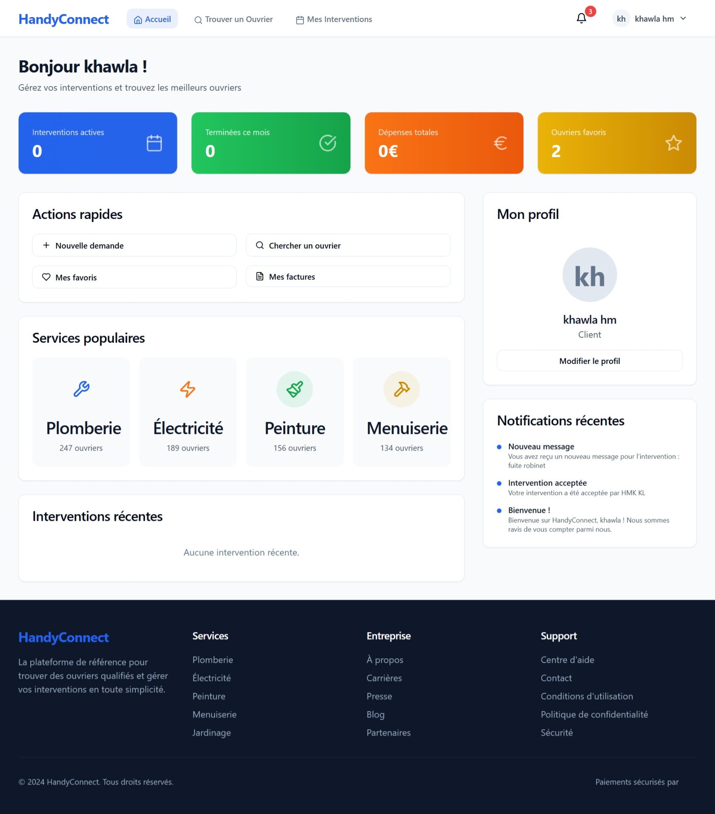

# HandyConnectPro – Gestion des Ouvriers 👷‍♂️

## 📌 Description
**HandyConnectPro** est une application web destinée à la **gestion des ouvriers et des missions**.  
Elle offre une interface moderne permettant de suivre les employés, gérer leurs tâches, et administrer les données via une base PostgreSQL.

Ce projet a été développé dans un cadre académique à l’INSEA pour mettre en pratique les compétences en développement **full-stack**.

---

## 🚀 Stack utilisée
- **Frontend :** React + Vite + Tailwind CSS + Shadcn UI  
- **Backend :** Node.js (Express) + TypeScript  
- **Base de données :** PostgreSQL  
- **ORM :** Drizzle ORM  

---


## ⚙️ Installation et configuration

### 1. Cloner le projet
```bash
git clone https://github.com/ton-utilisateur/HandyConnectPro.git
cd HandyConnectPro
